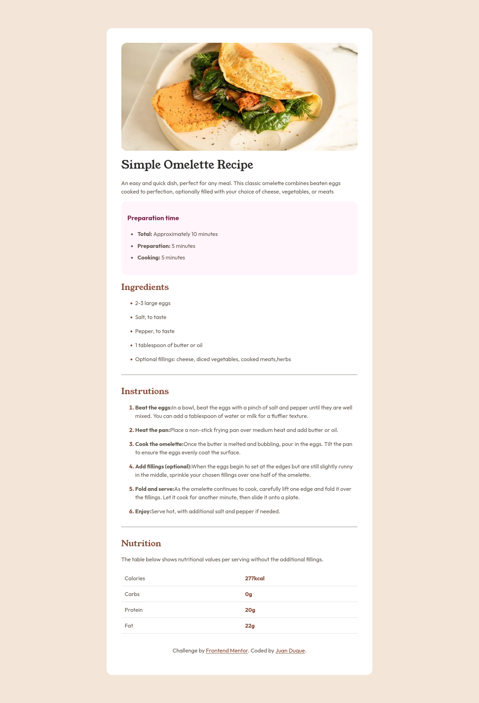

# Frontend Mentor - Recipe page solution

This is a solution to the [Recipe page challenge on Frontend Mentor](https://www.frontendmentor.io/challenges/recipe-page-KiTsR8QQKm). Frontend Mentor challenges help you improve your coding skills by building realistic projects. 

## Table of contents

- [Overview](#overview)
  - [The challenge](#the-challenge)
  - [Screenshot](#screenshot)
  - [Links](#links)
- [My process](#my-process)
  - [Built with](#built-with)
  - [What I learned](#what-i-learned)
  - [Continued development](#continued-development)
  - [Useful resources](#useful-resources)
- [Author](#author)

## Overview

### Screenshot

### Links

- Solution URL: [Add solution URL here](https://www.frontendmentor.io/solutions/flexbox-media-queries-fuZacuUWSR)
- Live Site URL: [Add live site URL here](https://boudgnosis.github.io/Recipe-page---omelete/)

## My process

### Built with

- Semantic HTML5 markup
- CSS custom properties
- Flexbox
- Media queries
- Images in webp format
- Desktop-first workflow
- [Normalize](https://necolas.github.io/normalize.css/)
- [Google fonts](https://fonts.google.com/)

### What I learned

Exploring website optimization, I learned about the WebP image format, which offers lower weight and good quality, improving loading speed.

### Continued development

I want to continue deepening in website optimization and improve my skills in responsive design to create more efficient and adaptable websites.

### Useful resources

- [¿Qué es WebP? El formato de imagen de última generación](https://es.siteground.com/kb/que-es-webp/). It helped me to understand the webp format much better.

## Author

- Linktree - [Juan Duque](https://linktr.ee/Boudgnosis)
- Frontend Mentor - [@boudgnosis](https://www.frontendmentor.io/profile/boudgnosis)
